# List

[Project] Remember upcoming birthdays (both solar and lunar), gifts, meetings, and tasks with this handy app. Users can opt into email and text notifications for upcoming events.

This app provides the user with the ability to keep all gift-giving information, such as a person's solar and/or lunar birthday, mailing address, email, phone number, and maximum budget, in one place. Users can also create records of gifts that they have given out in the past, create meetings and tasks, and receive e-mail and text reminders of upcoming birthdays, meetings, and tasks.

# Table of Contents

1. [Features](#features)
2. [Demo](#demo)
3. [Architecture](#arch)
4. [Build](#build)
5. [Known Issues](#issues)
6. [Credit](#credit)

<a name="features"></a>

# Features

Login / Sign Up

- Users can create an account using an e-mail address and password.
- Once the account is created, users can log in with their credentials.

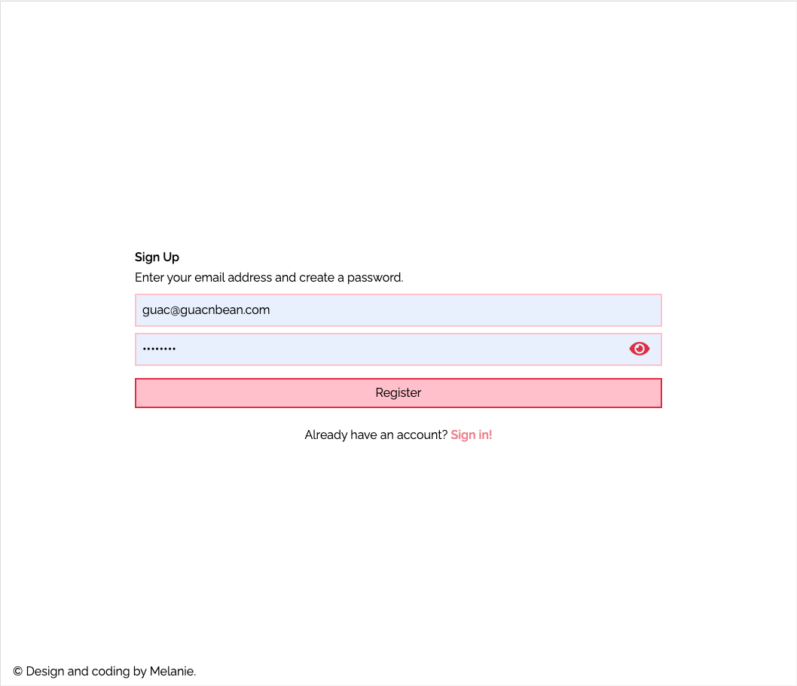
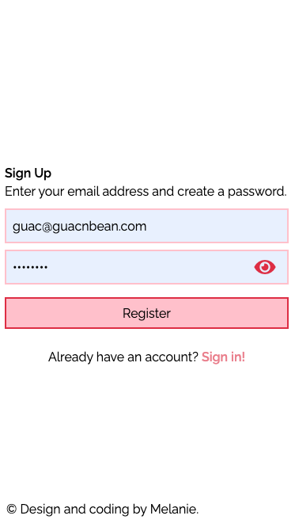

- Users who have forgotten their passwords can initiate recovery through the forgot password flow. A recovery e-mail with a unique, temporary link will be sent to the provided e-mail address.

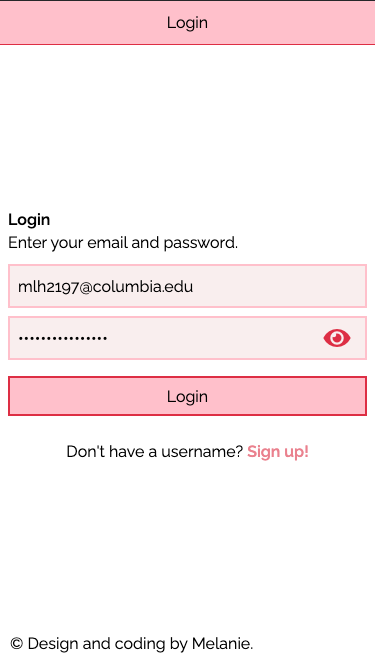
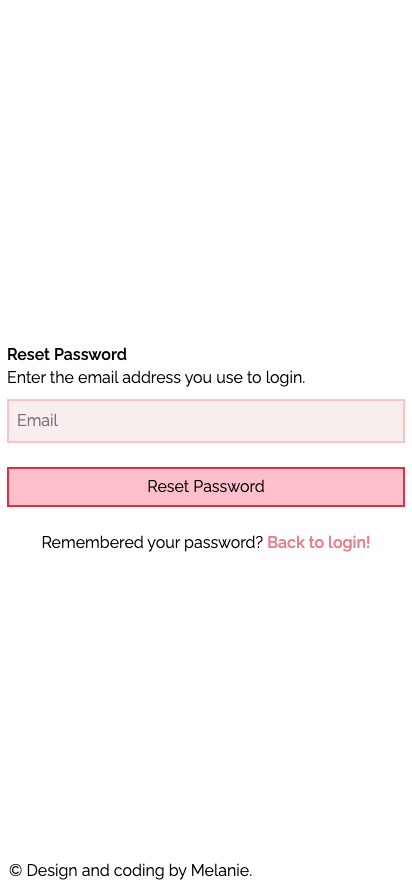
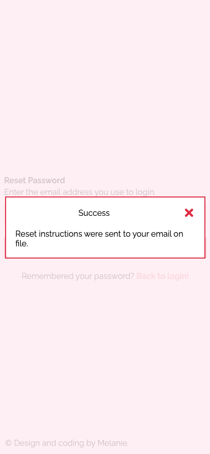

Home

- Provides a top-level view of the user's upcoming birthdays, meetings, and tasks.

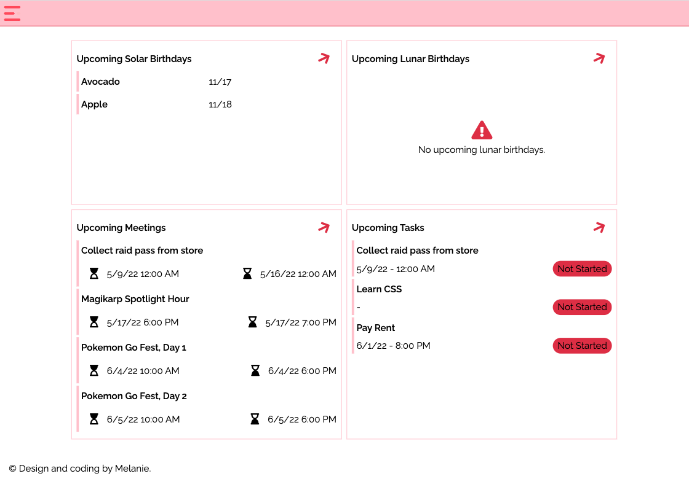

Calendar

- A two-year calendar view that displays as a monthly planner on smaller screens.
- Users can see the number of significant events on a particular day, week, or month.
- Clicking on an event type (ex. birthday) routes the user to the corresponding page.

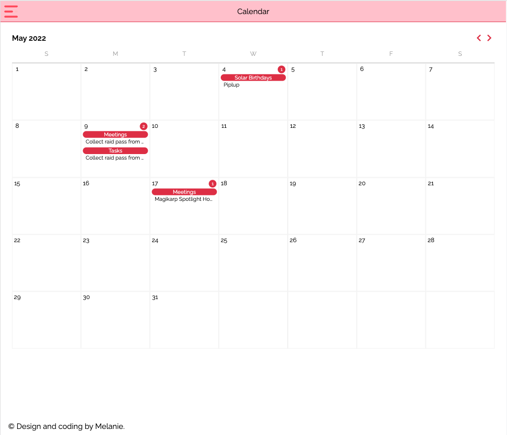
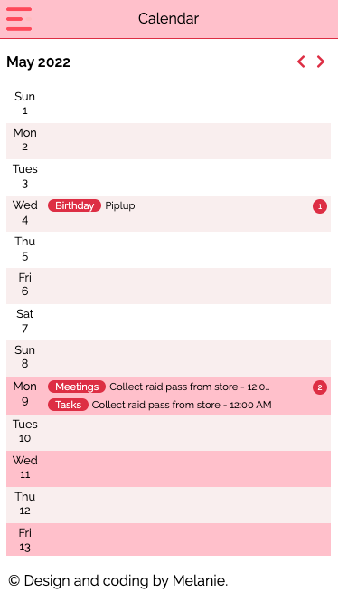

Menu

- The menu is used for navigation between the app's major pages.

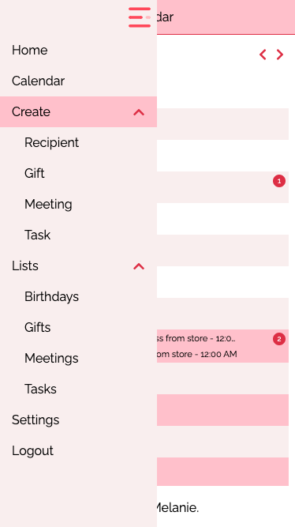

Add Recipient

- The Add Recipient form allows the user to provide information related to gift-giving, including the recipient's name, birthdate (including whether the birthday is lunar or solar), email, phone number, mailing address, and budget.
- If the user chooses the option to add a lunar birthday, a date picker with a lunar calendar will be displayed.
- Users can optionally upload a profile image that best represents the recipient.
- Users can specify how they would like to contact the recipient on their birthday (ex. call, text), and whether they would like to send a gift.

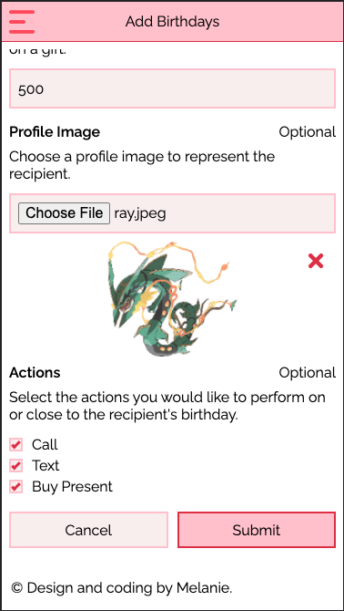
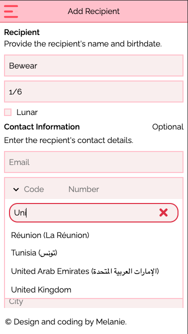
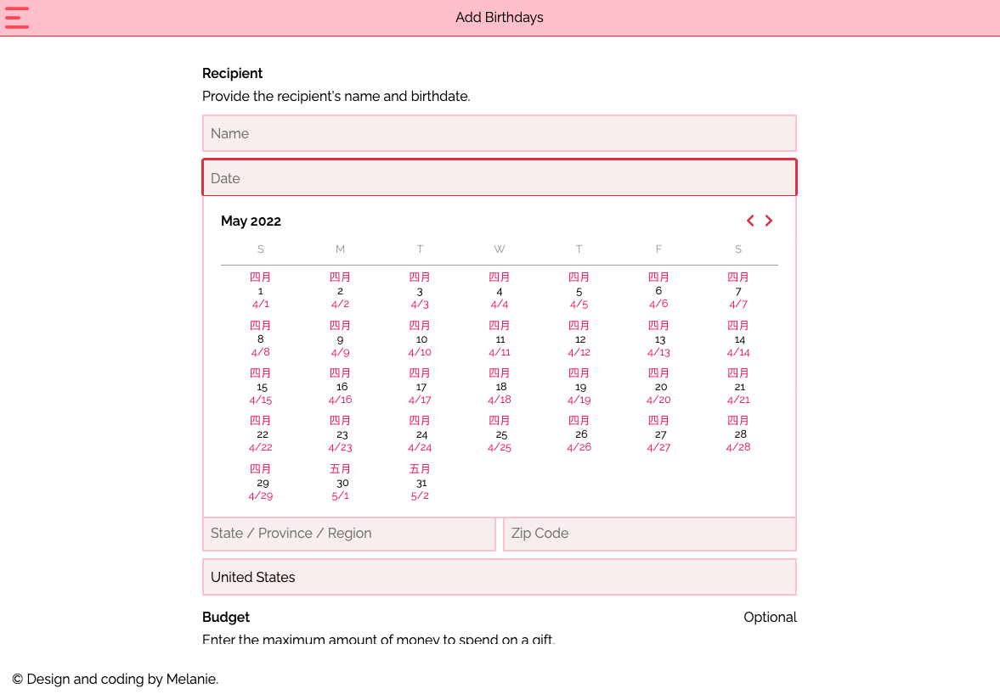
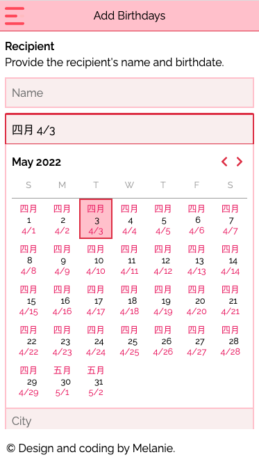

Add Gift

- The Add Gift form allows users to record a gift that was previously given to a recipient, or track future gifts they plan to give. Only recipients that were added through the Add Recipient form will appear on the recipients drop-down.
- The user can specify additional information about the gift, such as the occasion and the year it was gifted.
- The user can optionally upload an image of the gift and provide a description of the gift.


Add Meeting

- The Add Meeting form allows users to create a meeting.
- Users can specify the name of the event, the location (including whether it is virtual), the start and end dates/times, and optionally provide a description of the meeting.

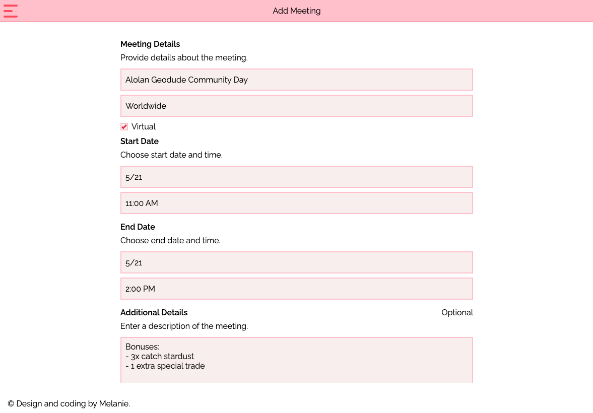

Add Task

- The Add Task form allows users to create a task.
- Users can specify the name of the task, its recurrence, and optionally provide a description of the task.
- Depending on the task recurrence, users can specify the status of the task (ex. whether it is completed or in progress), and the due date/time.

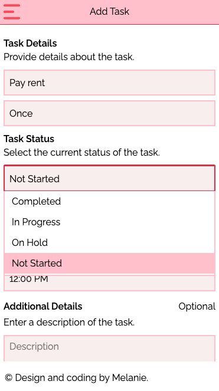

Birthdays

- Users can add (if no solar and/or lunar birthdays have been added), view, and modify a list of solar and lunar birthdays through this page.
- Each birthday is marked with an indicator of whether the date has already passed in the current calendar year.
- Upcoming birthdays will be marked with an indicator of how close the birthday is.
- On larger screens, the each recipient's profile image (if one was provided) will be displayed.

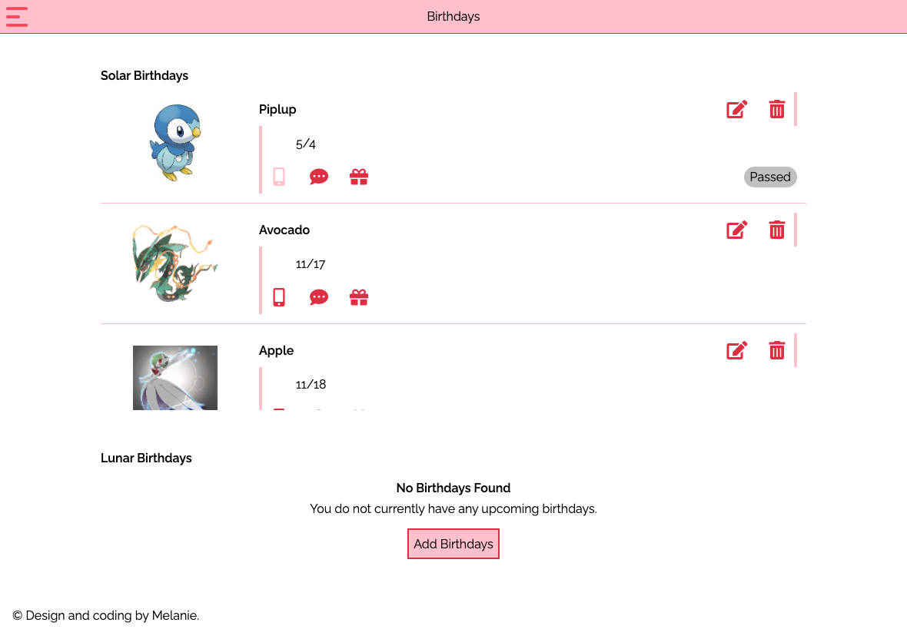
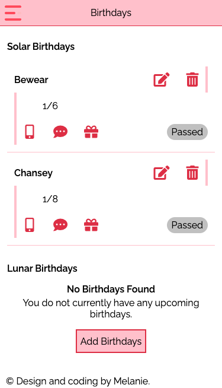

Gifts

- Users can view and modify (edit, delete) a list of gifts they've registered.
- There are options to sort by the recpient name, occasion, price, and year gifted.
- Users can also filter the list of gifts by recipient.

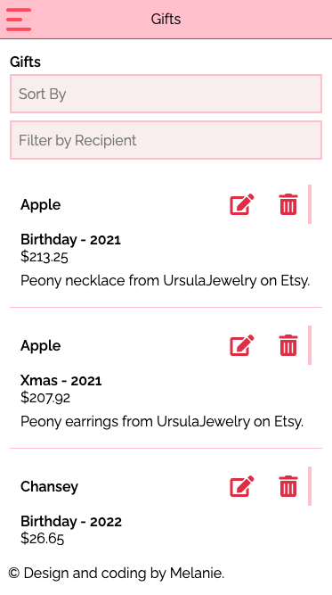
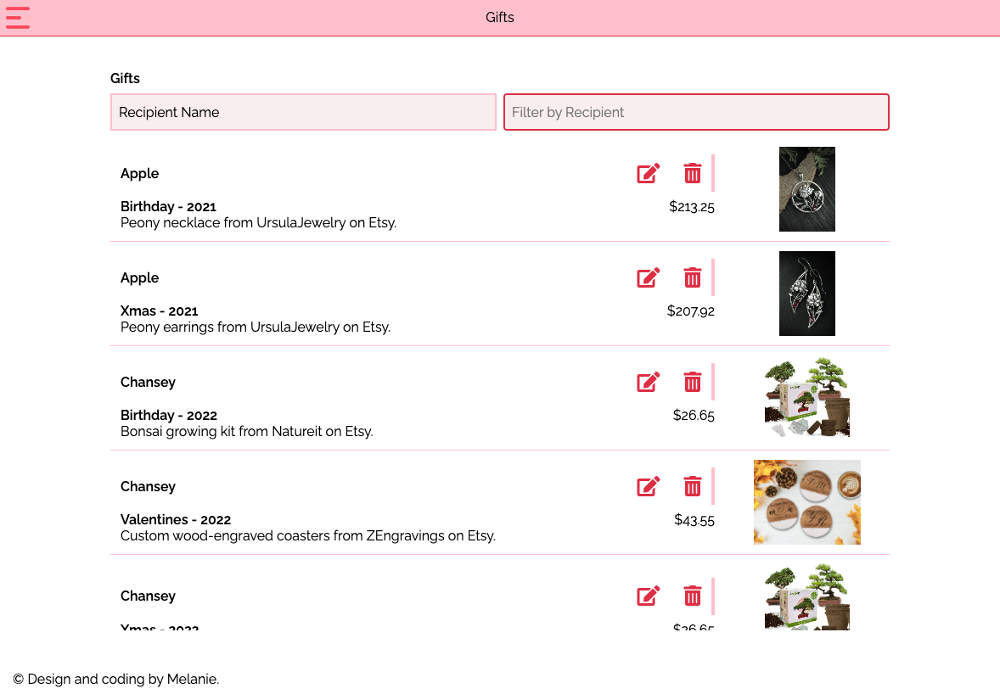

Meetings

- Users can view and modify (edit, delete) their list of meetings.
- Meetings with an imminent start date will show a badge based on their proximity to the current date and time.
- Virtual meetings will be shown with a special badge.

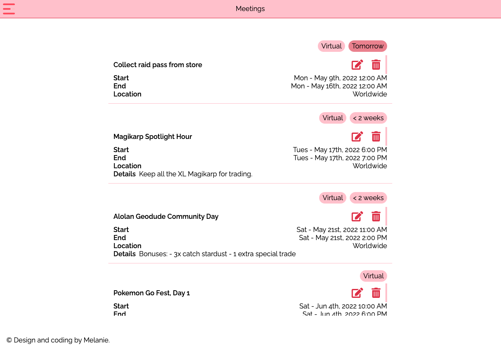

Tasks

- Users can view and modify (edit, delete) their list of tasks.
- Tasks will show a badge based on their recurrence (ex. one-time) and status (ex. not started).
- Users can filter tasks based on recurrence and status.

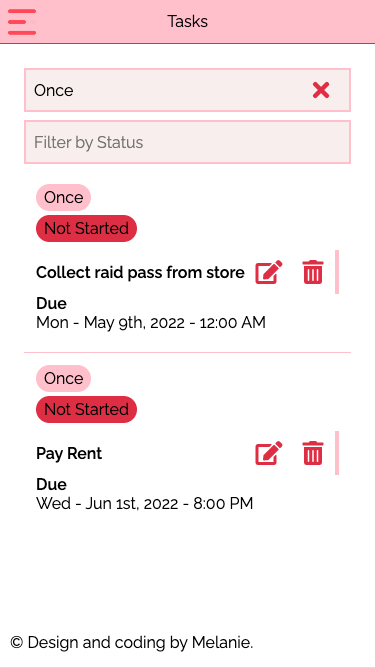

Settings

- Users who wish to receive e-mail and text notifications of upcoming events can provide their e-mail address and phone number, respectively.
- Users can select which types of events they wish to receive notifications for.

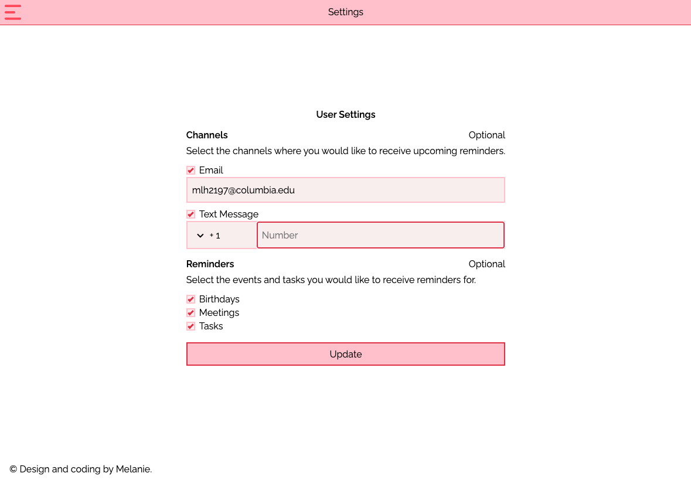

Session

- Users will be shown a dialog if they have been inactive for 4 minutes. If they do not action the dialog, or choose not to prolong their session, the session will be ended.
- The idle timeout is reset each time a service request is completed. Once the session timeout warning is shown, the idle timeout will be cleared, with no option to renew it for the remainder of this session.
- Users will recieve a dialog warning once the session is about to end. The session will automatically end after 15 minutes, or after 5 minutes of inactivity.

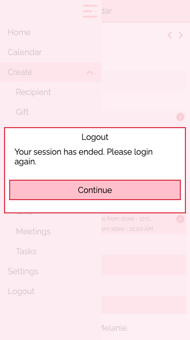

<a name="demo"></a>

# Demo 

TODO: add videos

<a name="arch"></a>

# Architecture

The client and server apps are hosted on the same server.

The Node server is responsible for:

- Handling calls to fetch the Chinese calendar (http://ccal.chinesebay.com/cgi-bin/ccal.cgi/).
- Login / registration.
- CRUD calls for the recipient, meeting, and task-related operations.

This server, along with a cron job that is run every 24 hours to send emails and/or texts about upcoming events to subscribed users, is kept active using the PM2 process manager.

A SQLite database is used to store user data.

## Forgot Password Flow

Users who have forgotten their passwords can initiate a forgot password flow from the Login page. The forgot password page contains a form where the user can enter the e-mail address that they use to login.

A database table on the server is maintained for each forgot password request. Each user can only have one active forgot password request at a time, and each request is only valid for 24 hours.

### Part I: Sending the Recovery Email
- When the server receives a forgot password reqeust, it generates a hash and a timestamp of when it received the request.
- If this is the user's first time initiating a forgot password request, a record with the username, timestamp, and encrypted hash is added to the forgot password database. Otherwise, the user's existing database entry is updated with the newly computed timestamp and hash.
- On successful storage and/or update of the user's database record, the Mailgun API is used to send a recovery email to the user. This email contains directions on how to reset the user's password and a link that contains the unencrypted hash.

### Part II: Submitting the Reset Password Request
- When the user clicks on the link in the email, a request is sent to the server.
- The server re-creates the encrypted hash from the provided hash, then queries the forgot password database table for the user's record.
- If a valid (non-expired) record is found, the server returns an HTML page containing the password reset form to the client. Otherwise, the server returns an HTML page containing an error.

### Part III: Resetting the Password
- The password reset form contains two fields: one for the user to enter a new password, and a hidden field whose value is set to the value of the hash.
- Once the user submits a valid password (the password validation rules are the same as the ones used on the front-end List app), a form post request is sent to the server.
- The server validates the password and uses the encrypted version of the hash to query the forgot password database. If a valid (non-expired) record is found, the server then updates the user's password in the username table.
- If the password is updated successfully, the server returns an HTML page containing a success message. Otherwise, it returns an HTML page containing an error message. Both pages contain a link to route the user back to the Login page.

## Computing Lunar Birthdays

TODO: add docs.

<a name="build"></a>

# Build

1. npm i
2. Install node v.16 locally:

   nvm install 16

Output:
v16.14.2 is already installed.
Now using node v16.14.2 (npm v8.5.0)

3.  npm run build --prod
4.  Copy the contents of the dist folder to the www sub-directory:

    cp dist/lists/\* ../www/list/ -r

5.  Set the base href in index.html:

<base href="/list/">

6.  Modify the nginx configuration:

    ## Remove root, then use alias for each Angular app.

```
    location ^~ / {
    alias /home/guac/www/;

        # First attempt to serve request as file, then
        # as directory, then fall back to displaying a 404.
        try_files $uri $uri/ /index.html =404;

    }

    location ^~ /list/ {
    alias /home/guac/www/list/;
    try_files $uri $uri/ /list/index.html =404;
    }
```

7.  Visit guacnbean.com/list

<a name="issues"></a>

# Known Issues

- updateOn: "submit" does not work consistently with all input forms. dateAndTimeValidator runs in-between submits (ex. user updates the Add Meeting datepicker field, and the error will update in real time, instead of on the next submit).

<a name="credit"></a>

# Credit

Icons made by:
<a href="https://www.flaticon.com/authors/dmitri13" title="dmitri13">dmitri13</a>
<a href="https://www.freepik.com" title="Freepik">Freepik</a>

from <a href="https://www.flaticon.com/" title="Flaticon">www.flaticon.com</a>

Tutorials:
<a href="https://www.freecodecamp.org/news/how-to-make-image-upload-easy-with-angular-1ed14cb2773b/">
How to make image upload easy with Angular
</a> by Filip Jerga

<a href="https://blog.angular-university.io/angular-push-notifications/">
	Angular Push Notifications: a Complete Step-by-Step Guide
</a>

<a href="https://dev.to/clairecodes/why-its-important-to-give-your-html-button-a-type-58k9">
	Why it's important to give your HTML button a type
</a>
